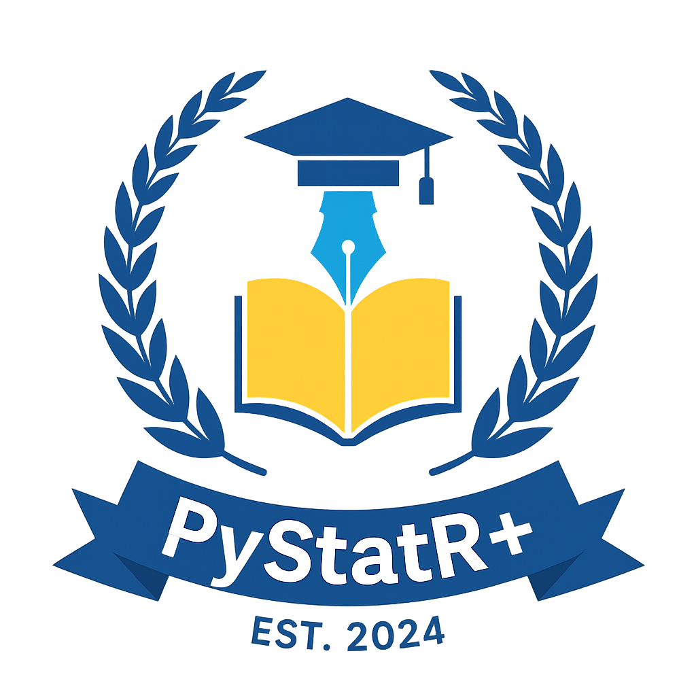
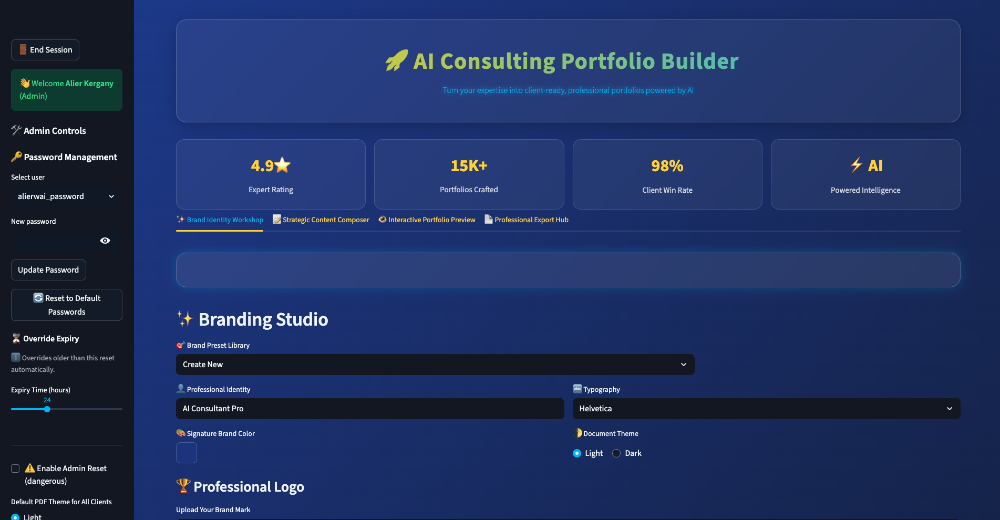

# 🚀 PyStatR+ AI Portfolio Builder

AI-powered consulting portfolio builder for professionals, clients, and organizations.  
This app is built and maintained by **PyStatR+** to help transform expertise into polished, client-ready portfolios with branding, strategy, and export features.

<p align="center">
  
</p>


**Futuristic Streamlit app** for building professional consulting portfolios,  
powered by **PyStatR+ branding, AI-driven content generation, and PDF exports**.  

> *Elevating Expertise into Professional Impact — Powered by PyStatR+*  

---

## ✨ Features

- 🔐 **Secure Authentication** (Admin & Client roles with password overrides)
- 🛠️ **Admin Dashboard**
  - Password management
  - Branding presets
  - Client theme settings
- 👤 **Client Dashboard**
  - Locked PyStatR+ branding
  - Simple portfolio creation
- 🎨 **Brand Identity Workshop**
  - Save and load brand presets
  - Upload logos, set colors, choose fonts
- 📝 **Content Composer**
  - Guided sections for summary, risks, opportunities, scenarios, and insights
- 👁️ **Live Preview**
  - Instant portfolio preview before export
- 📄 **Professional PDF Export**
  - Light & Dark themes
  - Automatic watermark and branding
  - Customizable sections with images

---

## 🛠️ Installation & Deployment

### Local Setup

1. **Clone the repository**

   ```bash
   git clone https://github.com/PyStatRPlus/pystatrplus-ai-portfolio.git
   cd pystatrplus-ai-portfolio
2. **Create and activate a virtual environment**
  ```bash
    uv venv
    source .venv/bin/activate


3. **Install dependencies**
  ```bash
  uv tool add -r requirements.txt


4. **Run the app**
  ```bash
  uv run streamlit run app.py


## ☁️ Deploy to Streamlit Cloud

[](https://streamlit.io/cloud)

### One-time setup
1. Push your code to GitHub: `https://github.com/PyStatRPlus/pystatrplus-ai-portfolio`
2. Open **Streamlit Cloud** → **New app**.
3. Select the repo: **PyStatRPlus/pystatrplus-ai-portfolio**, branch: **main**, main file: **app.py**.
4. Click **Deploy**.

### Required files
- `app.py` (the Streamlit app)
- `requirements.txt`
- `runtime.txt` → `python-3.13`
- `branding_presets.json` *(optional; auto-creates if missing)*
- `admin_settings.json` *(optional; auto-creates if missing)*
- `.streamlit/secrets.toml` *(add via Cloud → App → Settings → Secrets)*

**Example secrets:**
```toml
[users]
alierwai_password = "your_admin_password"
client1_password  = "client1_pass"
client2_password  = "client2_pass"


## 🔐 Secrets Configuration

  Create .streamlit/secrets.toml (it is ignored by Git):

    ```toml
    [users]
    alierwai_password = "your_admin_password"
    client1_password  = "client1_pass"
    client2_password  = "client2_pass"

## 🎯 Usage
  ### 🔑 1. Login

      * Username: alierwai, client1, or client2
      * Password: from .streamlit/secrets.toml or admin override

  ### 🛠️ 2. Admin Dashboard
      
      * Password management (overrides & resets)
      * Client settings (Light/Dark theme)
      * Branding presets
      * Strategic content composer
      * Live preview & export hub

  ### 👤 3. Client Dashboard

      * PyStatR+ branding locked
      * Add project details, opportunities, risks, scenarios, insights
      * Upload optional images
      * Preview and export your **PyStatR+ – branded portfolio PDF**

  ### 📄 4. Exported Portfolio PDF
    
      * Professional cover page with logo & branding
      * Auto-generated section dividers, tables, and images
      * Built-in watermark (logo or text fallback)
      * Closing thank-you page with PyStatR+ branding

## 🗺️ Roadmap

  **Short-term (v1.x)**
  
   * Multi-client management
   * Richer text editor
   * Theme preview toggle
   * Flexible branding presets
   
  **Medium-term (v2.x)**
  
   * AI-assisted drafting
   * Portfolio analytics
   * Multi-language export
   * Team collaboration mode

  **Long-term (v3.x+)**

   * Cloud storage integrations
   * Industry PDF templates
   * AI design assistant
   * SaaS platform

💡 Have a feature request? Open an [issue](https://github.com/PyStatRPlus/pystatrplus-ai-portfolio/issues) or a [pull request](https://github.com/PyStatRPlus/pystatrplus-ai-portfolio/pulls).


## 📜 License

This project is licensed under the 📜 
[](https://opensource.org/licenses/MIT).
You are free to use, modify, and distribute it with attribution.

**⚠️ Disclaimer:** The PyStatR+ brand name, logo, and branding elements are proprietary and not covered under this license.
This project is for **educational and professional development purposes only**, and is **independent of any employer or healthcare system.**

## 🤝 Contributions

External contributions are welcome but not required.
PyStatR+ leads official development and long-term support.

## 💡 About PyStatR+

PyStatR+ is an educational data-science initiative founded in 2024 to bridge the gap between academic statistics and real-world data science.
Focused on mentorship, professional development, and practical applications of Python, R, and statistics, PyStatR+ empowers professionals to build impactful careers and deliver data-driven results.

## 📄 Release Notes  

See all updates in the [Release Notes](docs/release_notes.md).  
You can also browse tagged versions on the [GitHub Releases page](https://github.com/PyStatRPlus/pystatrplus-ai-portfolio/releases).  
